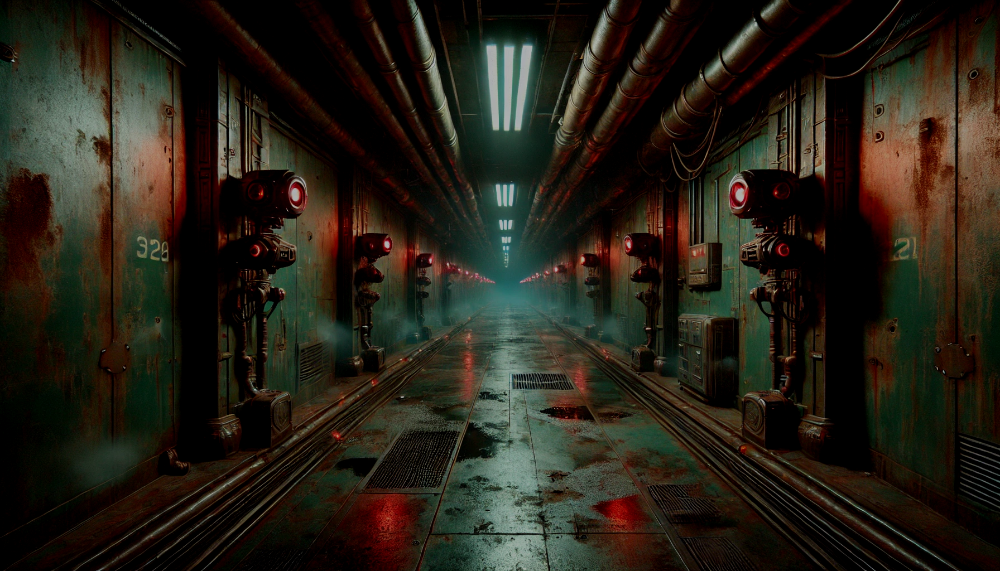

# UNIVERSIDAD NACIONAL DEL LITORAL

## Facultad de Ingeniería y Ciencias Hídricas

### Tecnicatura en Diseño y Programación de Videojuegos

**Proyecto Final**

\---

# GAME DESIGN DOCUMENT (GDD)

**Nombre del Juego:** Android Genesis
**Versión:** 1.0.0
**Fecha de actualización:** \[DD/MM/AAAA]

## Ficha del Alumno

|Apellido y Nombre Completo|Función dentro del proyecto|
|-|-|
|Bode, Andrés|Game Designer / Programmer / Artist / Level Design|

\---

## 1\. High Concept y Visión Inicial

**High Concept:** Un ingeniero despierta solo en un complejo tecnológico en ruinas y debe encontrar la salida mientras los drones que antes mantenían el lugar en funcionamiento ahora lo cazan, y la verdad sobre lo que pasó ahí dentro se revela de a poco.

\---

## 2\. Estructura Core del Proyecto

### 2.1 Objetivo del Proyecto

A nivel de producto, ofrecer una experiencia corta de terror psicológico centrada en la tensión de explorar un entorno hostil con recursos limitados. A nivel académico, este proyecto busca demostrar los conocimientos adquiridos a lo largo de toda la carrera: diseño de niveles, programación de mecánicas de juego, comportamiento de enemigos, ambientación audiovisual y estructuración de una narrativa a través del entorno.

### 2.2 Diseño e investigación

* **Definición de idea:** Android Genesis es un juego de terror psicológico en primera persona. El jugador controla a Lucas Borne, un ingeniero que debe explorar un complejo tecnológico en ruinas, defenderse de los drones que quedaron activos tras el incidente y avanzar hacia la salida, mientras descubre qué pasó con A1, un androide experimental.
* **Género:** Terror psicológico en primera persona, con exploración y combate.
* **Referencias:** *Dead Space* (ambientación sonora/visual y soledad del protagonista), *System Shock* (interacción con sistemas para progresar), *Half-Life* (balance entre exploración y resolución de problemas en un entorno hostil).
* **Público objetivo:** Jugadores de 18 a 35 años que disfrutan del terror psicológico, la exploración con propósito narrativo y los misterios por resolver.
* **Mecánicas principales:** Exploración del entorno, combate con recursos limitados y una mecánica de interacción/hackeo puntual para avanzar en ciertos puntos del nivel.

### 2.3 Concepto del Juego

En un futuro dominado por la tecnología, Lucas Borne participa en una prueba de rutina junto a A1, un androide con capacidades biológicas y tecnológicas. Durante la prueba, un fallo catastrófico convierte el complejo en un lugar hostil: los drones que antes se encargaban del mantenimiento y la seguridad del lugar quedan corruptos y hostiles, y una atmósfera cada vez más opresiva lleva a Lucas a enfrentar sus miedos mientras descubre la verdad sobre A1 y sobre los experimentos de la corporación.

El gancho principal del gameplay es la tensión de sobrevivir con recursos limitados: la munición del revólver y los botiquines son escasos, así que cada enfrentamiento tiene un costo.

### 2.4 Premisas del Videojuego

* El jugador nunca tiene información completa sobre el peligro: la tensión viene de no saber qué hay detrás de la próxima puerta.
* La historia se cuenta a través del entorno (notas, terminales, grabaciones), no mediante diálogos extensos ni cinemáticas.
* Los recursos (munición, botiquines) son escasos por diseño, lo que obliga al jugador a administrar cada enfrentamiento con cuidado.
* Ciertos puntos del nivel requieren interactuar/hackear un dispositivo puntual (una puerta, un terminal) para poder avanzar.

### 2.5 Condiciones del Desarrollo

* **Motor:** Unreal Engine 5.
* **Plataforma de destino:** PC.
* **Control de versiones:** Git / GitHub.
* **Metodología de trabajo:** \[A definir — sprints semanales, revisiones con el docente, etc.]
* **Limitaciones:** Desarrollo individual y tiempos acotados, por lo que el proyecto se enfoca en pulir un fragmento jugable acotado antes que abarcar contenido extenso.

### 2.6 Alcance del proyecto

El proyecto entrega un nivel jugable completo de 10 a 15 minutos de duración, ambientado en un sector del complejo (Sala Central, un pasillo y la Zona de Pruebas). Incluye: interacción/hackeo puntual en una puerta y un terminal, varios drones corruptos (originalmente de mantenimiento y seguridad) con patrulla y detección, un arma (revólver) con munición limitada, botiquines de salud, un puzzle ambiental, y 3-4 objetos narrativos que cuentan la historia del incidente.

\---

## 3\. Diseño Detallado del Juego

### 3.1 Elementos del Juego

* **Lucas Borne (personaje principal):** Ingeniero protagonista, equipado con un dispositivo de hackeo y un revólver.
* **A1:** Androide experimental, central para el misterio de la historia. Se revela a través de notas y grabaciones encontradas en el complejo, no como personaje jugable en este tramo.
* **Drones corruptos (enemigos):** Antes del incidente, estos drones cumplían tareas de mantenimiento, limpieza y seguridad dentro del complejo. Tras el fallo catastrófico, quedaron corruptos y hostiles. Cada uno patrulla una ruta fija, detecta por línea de visión y persigue al jugador si lo detecta.
* **Dispositivo de hackeo:** Herramienta que Lucas usa para interactuar con ciertos sistemas del complejo (puertas bloqueadas, terminales) cuando es necesario avanzar.
* **Revólver:** Arma de combate del jugador. Es un revólver de servicio que Lucas modificó por su cuenta antes del incidente, como medida de seguridad personal en un complejo donde ya existía desconfianza entre los ingenieros. Tiene 6 balas por tambor y recarga manual.
* **Consumibles:** Munición para el revólver y botiquines de salud.
* **Objetos narrativos:** Notas, terminales y grabaciones que revelan la historia del incidente y el rol de A1.

### 3.2 Reglas

* Hackear un dispositivo activa un mini-juego de timing: el jugador debe sincronizar una acción dentro de una ventana de tiempo.
* El revólver tiene munición limitada; recargar toma tiempo, durante el cual el jugador queda expuesto.
* Los drones detectan al jugador por línea de visión. Si lo detectan, persiguen y aumentan la tensión ambiental (sonido, luces). Agacharse reduce la probabilidad de ser detectado.
* Condición de derrota: la salud de Lucas llega a cero (por ataques de los drones).
* Condición de avance: llegar a la Zona de Pruebas tras resolver el puzzle ambiental.

### 3.3 Descripción de una sesión de juego

1. Lucas despierta en la Sala Central, con el complejo en ruinas.
2. Encuentra un terminal dañado y lo hackea para abrir la primera puerta.
3. Al avanzar, encuentra su revólver y se enfrenta a un dron corrupto.
4. Evita activar una alarma y descubre pistas narrativas en oficinas abandonadas.
5. Al hackear una puerta bloqueada, encuentra una grabación que revela más sobre A1.
6. La sesión termina cuando Lucas llega a la Zona de Pruebas y enfrenta a varios drones.

### 3.4 Estética y Experiencia del Jugador

El juego busca generar tensión sostenida y vulnerabilidad: el jugador nunca se siente completamente seguro, ni con munición ni con salud de sobra. Recargar el revólver expone al jugador frente a los drones, lo que obliga a elegir bien el momento de cada enfrentamiento. La curiosidad narrativa (qué pasó con A1) funciona como motor para seguir explorando pese a la tensión.

\---

## 4\. Arte, Audio y Bocetos

**Bocetos de Pantalla / UI:** 

!\[HUD del juego](imagenes/hud.jpg)

!\[Minijuego de hackeo](imagenes/minijuegohackeo.jpeg)

**Estilo Visual y Sonoro:**

* **Ambientes:** Instalaciones industriales en decadencia, con cables colgantes, luces parpadeantes y paredes oxidadas.
* **Paleta de colores:** Rojo oxidado, verde metálico y tonos oscuros.
* **Contraste:** Habitaciones en perfecto estado que contrastan con la ruina general, para generar inquietud.
* **Sonido:** Motores constantes, chisporroteos eléctricos y alarmas lejanas, junto con efectos perturbadores (susurros, jadeos, objetos moviéndose).
* **Música:** Minimalista y ambiental, con tonos metálicos y electrónicos.

